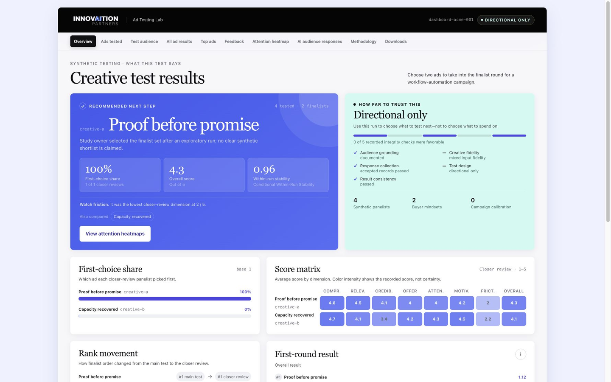
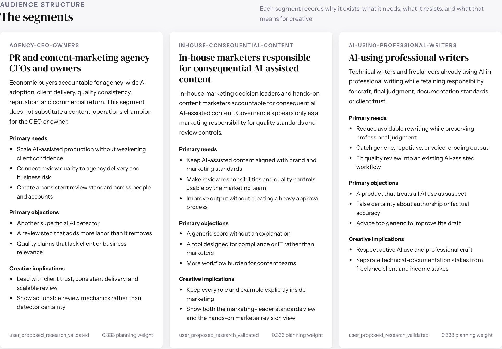
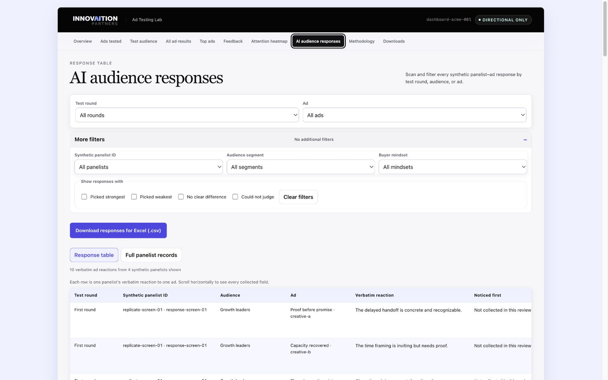
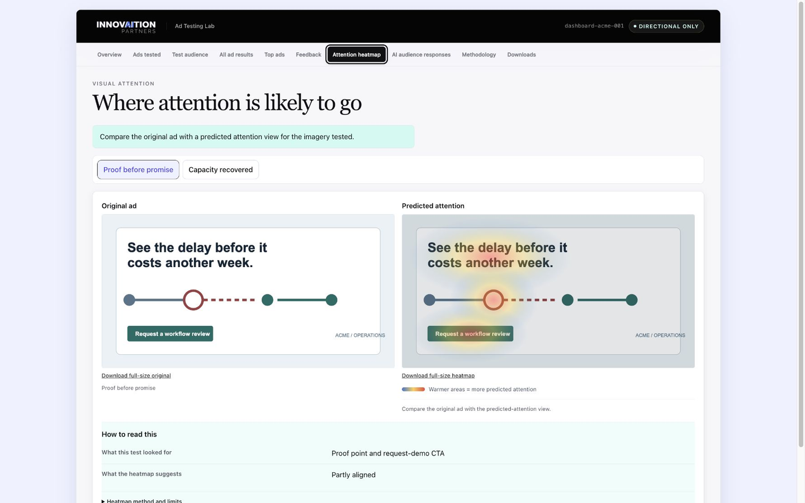

# Ad Testing Lab

Ad Testing Lab helps you test ads with synthetic audience panels: sets of audience profiles that AI uses as context. Give it 2–100 finished ads and a plain-language audience description, or use a saved panel if you already have one. It returns the AI's reactions and reasons, an HTML dashboard, and either a shortlist for a real-world test or an explanation that the responses did not support one. It does not predict clicks, conversions, revenue, or lift.

**New here? Start with [Ad Testing Lab for marketers](docs/guides/marketer-guide.md).** It explains in plain language where panel research comes from, how research becomes audience profiles, how the ads are tested, what appears in the dashboard, and what the predicted-attention heatmaps show.

## How it works

You give the tool finished ads and describe who they are for. It can research and create a reusable panel, create a one-time panel directly from your description, or reuse an approved panel you created earlier. Multiple separate synthetic "panelists" then react to the ads from those audience perspectives. You receive either a shortlist of what to run in a real campaign test or a clear explanation that the responses did not support a clear winner, plus the reasons behind the reactions, every AI response kept for the analysis, and a dashboard you can inspect.

Research-backed panels can use U.S. Census and Bureau of Labor Statistics data, published surveys and professional research, public communities and product reviews, authorized platform exports, licensed social-listening results, and approved summaries of customer research that do not expose individual records. Each panel shows which sources were actually used, direct links when available, what each source supports, and what remains unknown. [See exactly how panel research works](docs/guides/marketer-guide.md#where-the-audience-research-comes-from).

For ads with imagery, the tool creates or imports a predicted-attention heatmap for every tested image, carousel card, thumbnail, keyframe, or supplied video frame. The [SUM research model](https://openaccess.thecvf.com/content/WACV2025/html/Hosseini_SUM_Saliency_Unification_through_Mamba_for_Visual_Attention_Modeling_WACV_2025_paper.html) is one external image-analysis system the tool can use to generate these heatmaps. Heatmaps are shown only after the shortlist is approved, cannot change the ranking, and are not eye tracking or performance forecasts. [See what the heatmaps show](docs/guides/marketer-guide.md#what-the-predicted-attention-heatmaps-show).

Every ad test has two required steps: choose an audience panel, then run Ad Testing Lab on 2–100 finished ads. Using private data to shape the panel is optional. Comparing the panel's ad ranking with real campaign results is also optional, but you must record the ranking and campaign plan before launch.



## Required: choose an audience panel

Every test needs an audience panel. Choose one of these three routes:

| Audience route | Start with | What it produces |
|---|---|---|
| Research and save a new panel for repeated use | [Audience Panel Builder](skills/audience-panel-builder/README.md) | A human-readable audience report plus an immutable reusable panel package |
| Start now without audience research | [The provisional audience route](docs/guides/build-an-audience-without-research.md) | A clearly labeled one-run panel built from your audience description |
| Reuse a panel you created earlier | [Ad Testing Lab](skills/audience-ad-testing-lab/README.md) | A copy of the saved panel locked to this test |

## Required: test 2–100 finished ads

[Ad Testing Lab](skills/audience-ad-testing-lab/README.md) always runs the creative test. It returns AI feedback from the selected synthetic audience panel, a shortlist for a real test, source exports, and an HTML dashboard.

## Optional evidence steps

- Before choosing or building the panel, use [Audience Data Lab](skills/audience-data-lab/README.md) only when permissioned CRM or performance data should shape the audience. It releases privacy-reviewed summaries while keeping raw private rows out of prompts and panels.
- If you plan to run the tested ads in a real campaign, [Real-World Outcome Data Prep](skills/real-world-outcome-data-prep/README.md) records the panel's prediction and campaign plan before launch. After the campaign, it imports the platform's aggregate results and packages both sets of evidence for a separate check of whether the panel's ranking matched what happened. Data Prep does not run that comparison itself.
- When the same saved panel repeatedly ranks ads differently from eligible real campaign results, [Audience Panel Builder](skills/audience-panel-builder/README.md) can propose one narrow persona-behavior update, evaluate the complete new candidate against fresh results, and register it as a new version only after exact human approval. It never edits or silently activates the original panel.

### Improve a panel from real campaign results

Use Experimental Real-World Panel Calibration when the same saved panel has repeatedly ranked ads differently from what happened in eligible real campaigns. You provide or identify the aggregate campaign-result exports. The workflow routes new exports through Real-World Outcome Data Prep and Outcome Validation, confirms that the miss repeats across independent studies, checks whether delivery, tracking, targeting, timing, the offer, the landing page, or attribution better explains it, and—only when one narrow explanation survives—has Audience Panel Builder show you one proposed behavior change in one existing persona.

The system then creates a complete new panel candidate and shows the exact before-and-after diff. It does not edit or register the original panel. Because the earlier results were used to diagnose the change, they cannot also prove that the new candidate works. The workflow pauses until you run a fresh held-out campaign and provide its aggregate results. If that separate validation supports the candidate and every evidence gate passes, the system asks you to approve the exact change and the exact new panel version. Approval registers a new version without overwriting or silently activating anything.

Read [How the four capabilities work together](docs/how-it-works.md) for the complete sequence.

## What the workflow looks like

1. **Define the decision.** Name the audience, exact ads, campaign context, and what the live test needs to decide.
2. **Choose an audience route.** Build a new research-backed panel, create a clearly labeled provisional audience for one immediate run, or reuse a researched panel you created earlier.
3. **Freeze the test plan.** The planner shows which audience profiles will review the ads, how many AI responses it will collect, how many backup responses it will reserve, the estimated cost, and what you must approve before testing begins.
4. **Collect and aggregate feedback.** Each AI response reviews ads in a separate context. Fixed scoring code measures how consistent the responses are, selects the shortlist, and reports when there is not enough reliable feedback.
5. **Review and learn.** Open the marketer-ready dashboard, inspect the underlying responses, and decide what belongs in a real campaign. If you want to compare the panel's ranking with a real campaign, record the prediction and campaign plan before launch. After the campaign, import the aggregate platform results for Real-World Outcome Validation.

See the complete [end-to-end lifecycle](docs/how-it-works.md) or go directly to a guide:

- [Build a reusable audience panel](docs/guides/build-an-audience-panel.md)
- [Test ads now without audience research](docs/guides/build-an-audience-without-research.md)
- [Test a finished creative set](docs/guides/test-ads.md)
- [Use permissioned private audience data](docs/guides/use-private-audience-data.md)
- [Prepare and validate against real campaign results](docs/guides/validate-with-real-results.md)

## What you provide

- Finished ad variations: exact copy, images, carousel cards, or representative video frames.
- The campaign decision, goal, funnel stage, offer, audience, buying context, and success metric.
- Enough direction to research a panel, a plain-language audience description for a provisional one-run panel, or a saved panel you created earlier.
- Optional permissioned CRM or performance data for Audience Data Lab to summarize before panel building. Raw rows remain inside that controlled workflow.
- Optional original results files exported from the ad platform after a campaign. These files must contain totals by ad rather than person-level rows, and the prediction and campaign plan must have been recorded before launch. For experimental panel calibration, you provide the eligible result exports that show the repeated miss and later provide a separate fresh held-out result export; the system prepares the calibration evidence and candidate.
- Inspectable imagery for image, carousel, or represented-video studies.

Ad Testing Lab does not silently convert strategy notes, landing-page fragments, or message ideas into test-ready ads. The exact creative roster must be supplied or explicitly confirmed before testing.

## What you receive

- A human-readable audience review showing segments, representative profiles, needs, objections, supporting research, and unknowns.
- A locked test plan showing who the synthetic panel represents, how many AI responses will run, which backup responses are reserved, the order in which ads appear, and what has been approved.
- AI feedback that has been checked, with a record of which responses were kept and which were rejected.
- Screening results labeled `valid`, `exploratory`, `invalid`, or `incomplete`.
- A self-contained HTML dashboard with marketer-facing conclusions and downloadable source exports.
- After you approve the finalists, heatmaps showing which parts of each image receive the most visual emphasis.
- An optional validation package containing the panel's saved prediction, campaign plan, aggregate platform results, and reports showing whether the files are complete and each result maps to the correct ad.
- For an eligible experimental calibration, a review of the repeated miss, one proposed persona-behavior change, the exact before-and-after diff, a complete new panel candidate, its fresh validation result, and the final approval request.

Read [Outputs and files](docs/reference/outputs-and-files.md) for what each HTML, CSV, JSON, ZIP, and dashboard download is for.

## A populated audience panel

Grounded profiles are research-backed descriptions of audience types: their context, needs, objections, and decision factors. The test planner reuses each profile as the basis for multiple AI responses to your ads. A profile is not a person or a respondent. Human respondents: 0.



Learn the distinction among [profiles, synthetic replicates, model calls, and people](docs/concepts/profiles-replicates-and-people.md).

## What the evidence means

The feedback depends on the audience description, ads, test settings, AI model, and specific run. Change any of those inputs and the feedback may change. It can help stress-test messages, expose disagreements, organize qualitative reactions, and choose candidates for a real test.

It cannot establish:

- how a population will respond;
- survey percentages or market prevalence;
- human-sample statistical significance;
- predicted CTR, conversion, pipeline, revenue, or lift;
- whether the synthetic audience reflects real campaign behavior unless its saved prediction is compared with campaign results collected afterward.

Read [Synthetic evidence and validity](docs/concepts/synthetic-evidence-and-validity.md) for the claim boundaries and [Methods and capacity](docs/reference/methods-and-capacity.md) for the two screening designs.

## Dashboard

The dashboard separates the decision summary from the underlying evidence. Its tabs cover the ads tested, test audience, complete results, top ads, feedback, attention evidence, AI audience responses, methodology, and downloads.





## Installation

### Claude Code

```text
/plugin marketplace add innovaitionpartners/audience-ad-testing-lab
/plugin install audience-ad-testing-lab@innovaition-ad-testing
```

### OpenAI Codex

```bash
codex plugin marketplace add innovaitionpartners/audience-ad-testing-lab --ref main
codex plugin add audience-ad-testing-lab@innovaition-ad-testing
```

### Gemini CLI

```bash
gemini extensions install https://github.com/innovaitionpartners/audience-ad-testing-lab
```

The repository is public and can be installed directly from GitHub using the commands above. To contribute or run the project from source, use a local checkout. See [Contributing](CONTRIBUTING.md) for dependencies, development commands, release manifests, and CI.

## Documentation

- [Plain-language guide for marketers](docs/guides/marketer-guide.md)
- [Documentation home](docs/README.md)
- [How it works](docs/how-it-works.md)
- [Guides](docs/README.md#guides)
- [Research and validity concepts](docs/README.md#concepts)
- [Technical reference](docs/README.md#reference)
- [Examples and screenshots](docs/examples/README.md)
- [Development and release](docs/maintainers/development-and-release.md)

## Privacy

Row-level private data belongs only in Audience Data Lab’s controlled local workflow. Raw names, emails, account identifiers, private messages, person-level records, and unsuppressed small cells never belong in prompts, reusable panels, dashboards, examples, or this repository. Read [Privacy and data boundaries](docs/reference/privacy-and-data-boundaries.md).

## Release status

Audience Ad Testing Lab is publicly available, maintained by InnovAItion Partners and licensed under the [Apache License 2.0](LICENSE). See [NOTICE](NOTICE).

Built by [InnovAItion Partners](https://github.com/innovaitionpartners).
